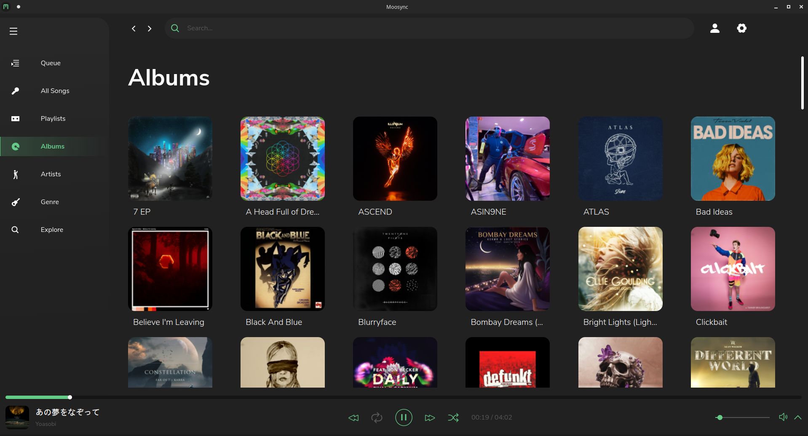
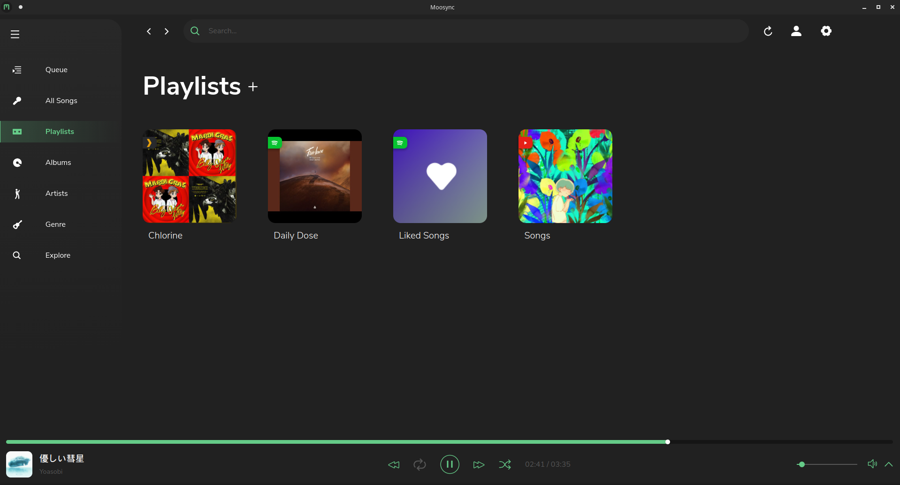
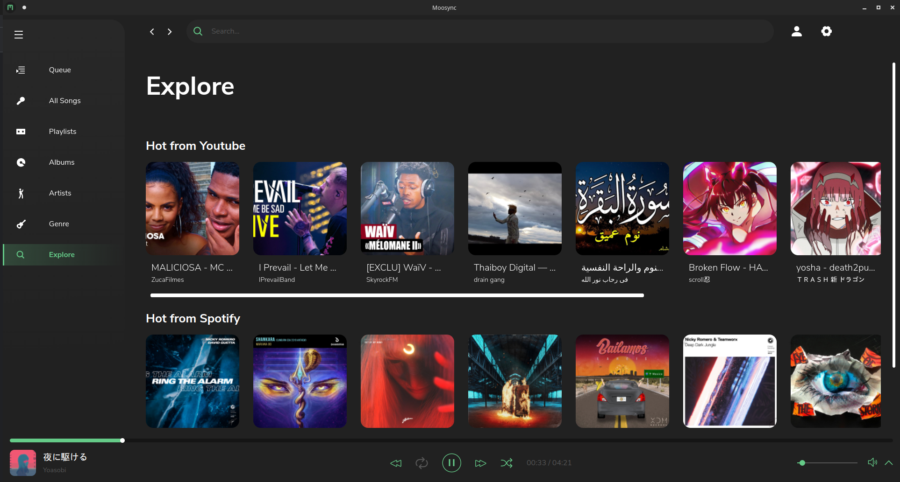
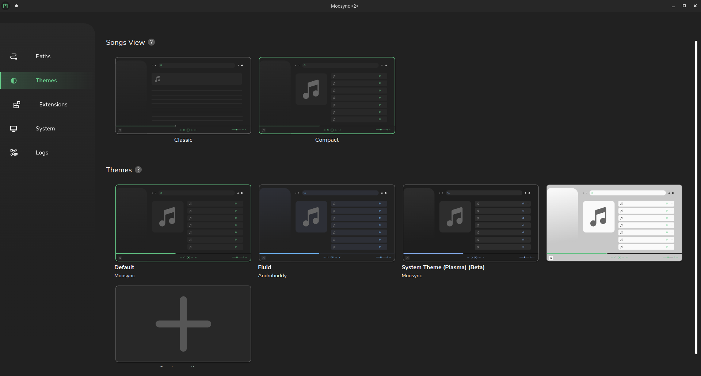
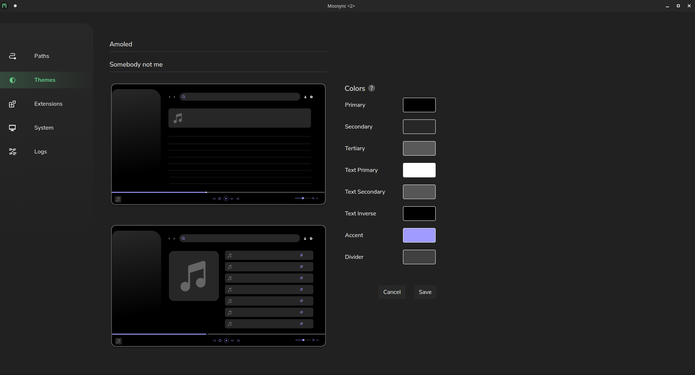
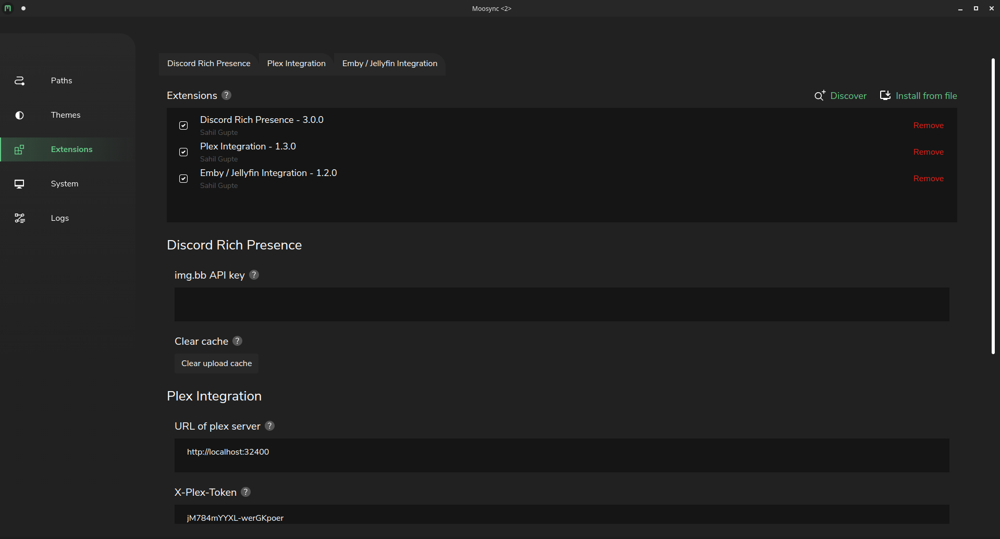

# Moosync

[](#contributors-)  [](https://discord.gg/HsbqbRune3) [](https://crowdin.com/project/moosync)

<p align="center"><b>Help up translate the project at <a href="https://crwd.in/moosync">Crowdin</a></b></p>

<br/>

#### Moosync is a customizable desktop music player with a clean interface

## Features

- Play audio files on your desktop.
- Seamlessly integrate your Spotify and Youtube (including [Invidious](https://invidious.io/)) songs.
- Ad-free
- Realtime lyrics
- Scrobble your tracks on LastFM.
- Get music recommendations directly from Spotify, Youtube and LastFM
- Mix and match songs from different providers in a single playlist
- Easy to use interface
- Customizable theme engine
- Develop own apps on top of Moosync Extension API
- Available on Windows and Linux and MacOS

## Links

[Official website](https://moosync.app) |
[Downloads](#releases) |
[Discord](https://discord.gg/HsbqbRune3)
[Crowdin](https://crwd.in/moosync)

## Releases

You may download the latest release from [Official website](https://moosync.app) or from [GitHub Releases](https://github.com/Moosync/Moosync/releases)

### Windows (Chocolatey)

If you use [Chocolatey](https://community.chocolatey.org/packages/moosync), Moosync can be installed using

```bash
choco install moosync
```

Otherwise you may download the latest installer from [Releases](https://github.com/Moosync/Moosync/releases)

### Ubuntu / Debian (3rd party repo)

You can install Moosync through our hosted [APT repo]([/Moosync/ppa](https://github.com/Moosync/ppa))

```bash
bash <(wget -O- https://raw.githubusercontent.com/Moosync/Moosync/main/setup_ppa.sh)
```

### Fedora

Moosync can be found on [Fedora COPR](https://copr.fedorainfracloud.org/coprs/ovenoboyo/Moosync/). You can install it using [dnf](https://docs.fedoraproject.org/en-US/quick-docs/dnf/)

```bash
dnf copr enable ovenoboyo/Moosync
dnf install moosync
```

### Archlinux User Repository (AUR)

Moosync can be found on [AUR](https://aur.archlinux.org/packages/moosync). You can install it using an AUR helper such as [Yay](https://github.com/Jguer/yay)

``` bash
yay -S moosync
```

### Flatpak

Moosync can be found on [FlatHub](https://flathub.org/apps/details/app.moosync.moosync) as ```app.moosync.moosync```.
You may install it by

```bash
flatpak install flathub app.moosync.moosync
```

### Snap Store

You can get Moosync from [Snap store](https://snapcraft.io/moosync).

```
sudo snap install moosync
```

## Any questions?

Checkout the [Official Wiki](https://moosync.app/wiki/) on [moosync.app](https://moosync.app/wiki/) or on [GitHub](https://github.com/Moosync/Moosync/wiki).  
  
For any further questions you may join us on [Discord](https://discord.gg/HsbqbRune3)

## Screenshots









## Building from source

Read more at our [Wiki](https://moosync.app/wiki/building-from-source)

## Contributors ✨

Thanks goes to these wonderful people ([emoji key](https://allcontributors.org/docs/en/emoji-key)):

<!-- ALL-CONTRIBUTORS-LIST:START - Do not remove or modify this section -->
<!-- prettier-ignore-start -->
<!-- markdownlint-disable -->
<table>
  <tr>
    <td align="center"><a href="https://github.com/Mercyssh"><br /><sub><b>Ohm</b></sub></a><br /><a href="#design-Mercyssh" title="Design">🎨</a></td>
    <td align="center"><a href="http://androbuddy.github.io/studio-wingress"><br /><sub><b>Anirudh</b></sub></a><br /><a href="#design-AndroBuddy" title="Design">🎨</a></td>
    <td align="center"><a href="https://github.com/Ovenoboyo"><br /><sub><b>Sahil Gupte</b></sub></a><br /><a href="https://github.com/Moosync/Moosync/commits?author=Ovenoboyo" title="Code">💻</a></td>
  </tr>
</table>

<!-- markdownlint-restore -->
<!-- prettier-ignore-end -->

<!-- ALL-CONTRIBUTORS-LIST:END -->

This project follows the [all-contributors](https://github.com/all-contributors/all-contributors) specification. Contributions of any kind welcome!

## Donations

| Cryptocurrency | Address |
| --- | --- |
| Bitcoin (BTC) | bc1qhcywctcy4exkcdd726d2lxkwaluqwgym0ynf9j |
| Ethereum (ETH)| 0x0AFaCe6031e2fBe54D2fBF493310C0f5C3Cef677 |
| Dogecoin (DOGE) | bc1qhcywctcy4exkcdd726d2lxkwaluqwgym0ynf9j |
| Litecoin (LTC) | LLkim24N5yduBbXiFaLMbUeUwmyZ9VUQt7 |
| Polygon (MATIC) | 0x0AFaCe6031e2fBe54D2fBF493310C0f5C3Cef677 |
| Tether USD (USDT) | 0x0AFaCe6031e2fBe54D2fBF493310C0f5C3Cef677 |
| USD coin (USDC) | 0x0AFaCe6031e2fBe54D2fBF493310C0f5C3Cef677 |
